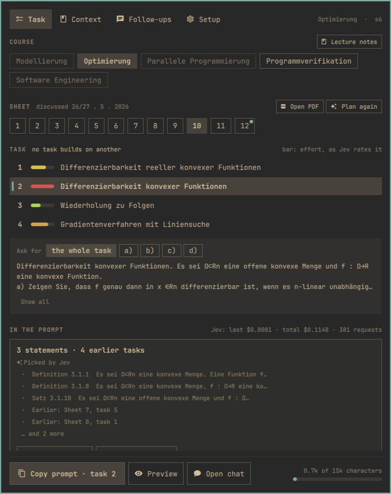
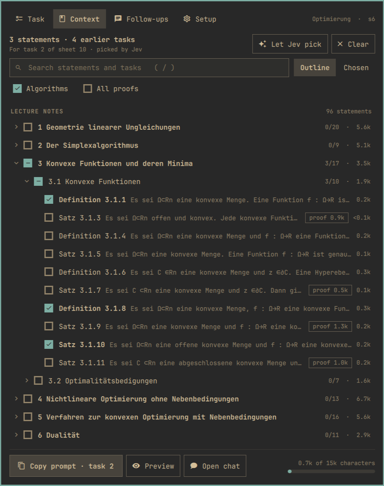
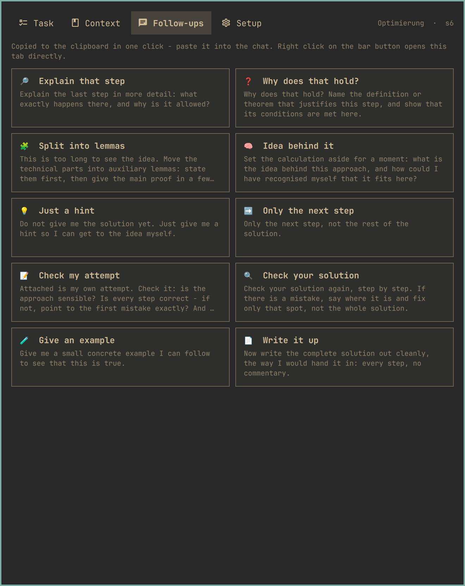

# AssignmentVibe

A panel in the [Omarchy](https://omarchy.org) bar that turns the maths
exercise you are working on into a precise prompt for ChatGPT or Claude: the
task, the definitions and theorems of *your* lecture notes it needs, and the
earlier exercises it builds on - one click, onto the clipboard.


> **Fully vibe-coded.** Every line here - code, docs and this README - was
> written by an AI (Claude) from plain-language descriptions, and I have not
> reviewed it line by line. The PDF extraction was checked against ten sets of
> lecture notes and ~190 real problem sheets, the context editor's logic has
> tests, and the panel was driven on a real Omarchy desktop and checked by
> screenshot. It works on my machine; read it with that in mind.

**Task** - course, sheet and task side by side, and what goes into the prompt:



**Context** - the outline of the lecture notes: tick chapters, statements,
proofs, and tasks of earlier sheets:



<details>
<summary><b>Follow-ups</b> - canned replies for the chat, one click each</summary>
<br>

</details>

## What it does

- **Knows your course.** Lecture notes and problem sheets (PDF) are read into
  a small knowledge base: every definition, theorem and proof, placed in the
  outline of the notes; every task of every sheet, split into its parts. A
  sheet that only says "Lösen Sie Aufgabe (1.11) vom Skriptum" gets the
  exercise's text from the notes. A course taught from slides is read slide
  by slide: each one is a statement of its own, placed under its lecture and
  the part of the deck it is in.
- **You pick the context - or let Jev pick it.** Tick chapters, single
  statements and their proofs, and tasks of earlier sheets. Optionally, Jev
  (a yes/no decision model on OpenRouter, fractions of a cent per pick)
  judges for each statement whether the task needs it. Nothing chosen means
  no context - nothing is guessed.
- **Takes you there.** Every statement, slide and section in the context
  opens the script or slide deck at its page with one click - to look up
  what Jev picked without searching the PDF for it.
- **Plans a sheet.** Jev once per sheet: each task's context, how much work
  each is (the bar beside it, green to red), and which task builds on which.
- **One part at a time.** For a task with a), b), c): ask for one part; the
  whole task stays in the prompt for reference.
- **Asks for a model solution.** The prompt asks for the direct route, every
  step justified, the hard ones in full - no padding - and to name and quote
  any result it uses that is not in the notes.
- **Follow-ups** for the chat, one click each: *Just a hint*, *Only the next
  step*, *Split into lemmas*, *Check my attempt*, …
- **Files your downloads.** A per-semester `uni.json` says which PDF belongs
  to which course; `sort` files new downloads into `~/Uni/<semester>/<course>`,
  and the launcher (Super+Space) finds every script and slide set. See
  [docs/SORTING.md](docs/SORTING.md).

Bar button: left click opens the panel, right click the follow-ups, middle
click copies the prompt straight away. In the panel, Enter copies.

## Install

Omarchy 4 (the Quickshell-based bar), Python 3.10+ and pymupdf. The
repository is the plugin:

```bash
sudo pacman -S python-pymupdf
omarchy plugin add https://github.com/flitscha/AssignmentVibe.git --enable
```

Then, in the panel's Setup tab: fill in `uni.json` (your semester's courses
and how their PDFs are named), and *Read in new PDFs*. For Jev, put an
[OpenRouter](https://openrouter.ai) key into
`~/.config/assignmentvibe/openrouter.key` - the Setup tab creates the file
with the right permissions. Tesseract is optional (see below).

For the terminal commands, put the launcher on your PATH:

```bash
ln -s ~/.config/omarchy/plugins/felix.assignmentvibe/bin/assignmentvibe ~/.local/bin/
```

Working on it: clone it anywhere and run `./install.sh`, which links the
checkout into the plugin folder instead.

What the plugin does on your machine - processes, files, network - is listed
in [docs/PANEL.md](docs/PANEL.md#what-it-does-on-your-machine).

## From the terminal

```bash
assignmentvibe copy [--task N] [--part b] [--jev]   # the prompt, onto the clipboard
assignmentvibe build ...                            # the same, printed
assignmentvibe plan [--show]                        # let Jev plan the current sheet
assignmentvibe sort [--apply]                       # file new downloads
assignmentvibe followup [N]                         # the follow-ups
assignmentvibe work [--task N] [--list]             # handwritten work, see below
```

`assignmentvibe --help` lists the rest.

## Experimental: handwritten work

If you solve the sheets in Xournal++ and paste each task's statement in as a
screenshot, `assignmentvibe work` finds the sheet's notebook, recognises the
pasted statements (Tesseract) and draws your handwriting for a task as one
PNG. Turning that into text for the prompt is not solved yet - see
[docs/ROADMAP.md](docs/ROADMAP.md).

## More

- [docs/PANEL.md](docs/PANEL.md) - how the panel is built, keys, IPC
- [docs/ARCHITECTURE.md](docs/ARCHITECTURE.md) - module map and why
- [docs/STATUS.md](docs/STATUS.md) - what is implemented and tested
- [docs/ROADMAP.md](docs/ROADMAP.md) - what's next
- [docs/example_prompts/](docs/example_prompts/) - what a finished prompt looks like

Course material (lecture notes, sheets, and the text extracted from them) is
not part of this repository; bring your own PDFs.

MIT licensed.
